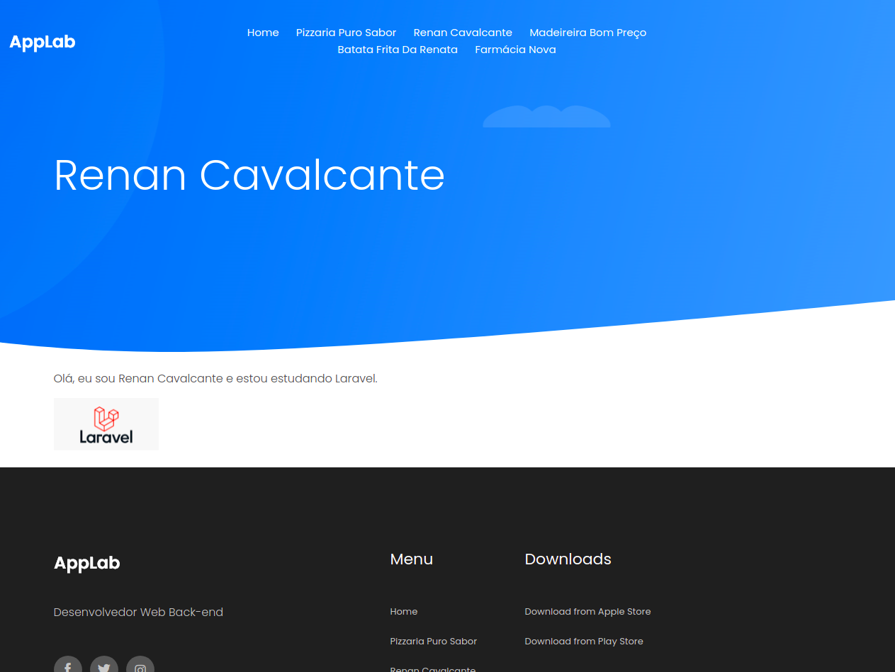
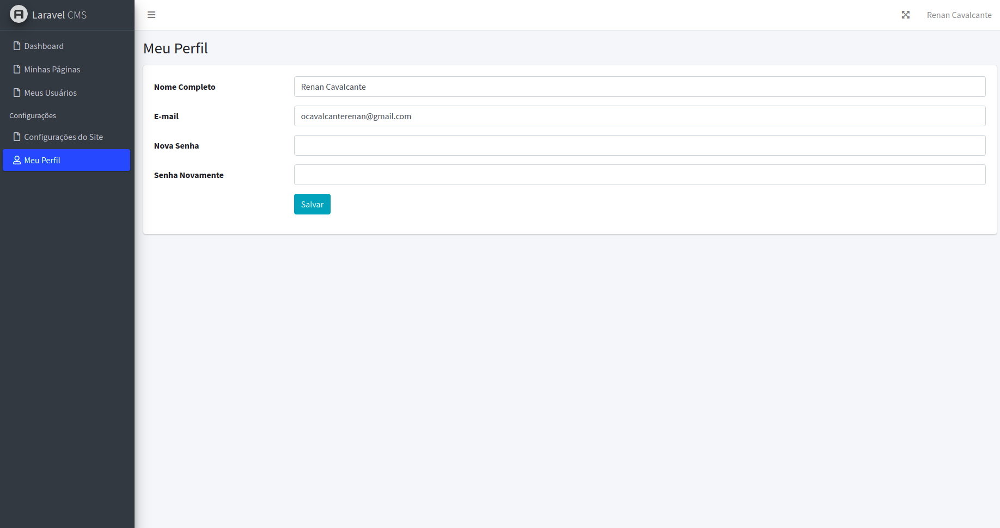
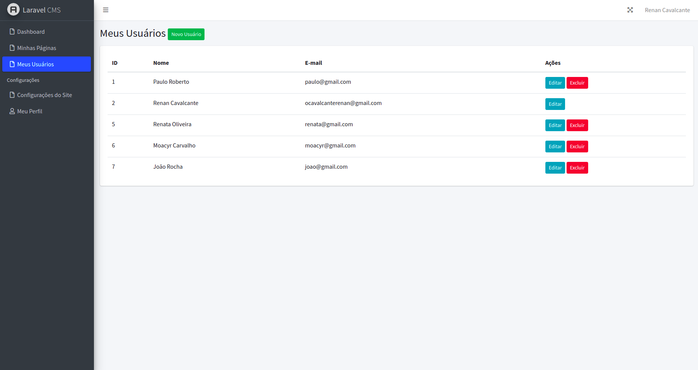
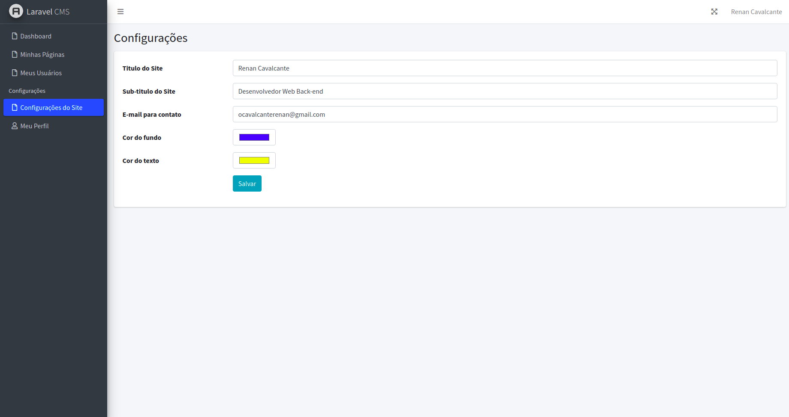
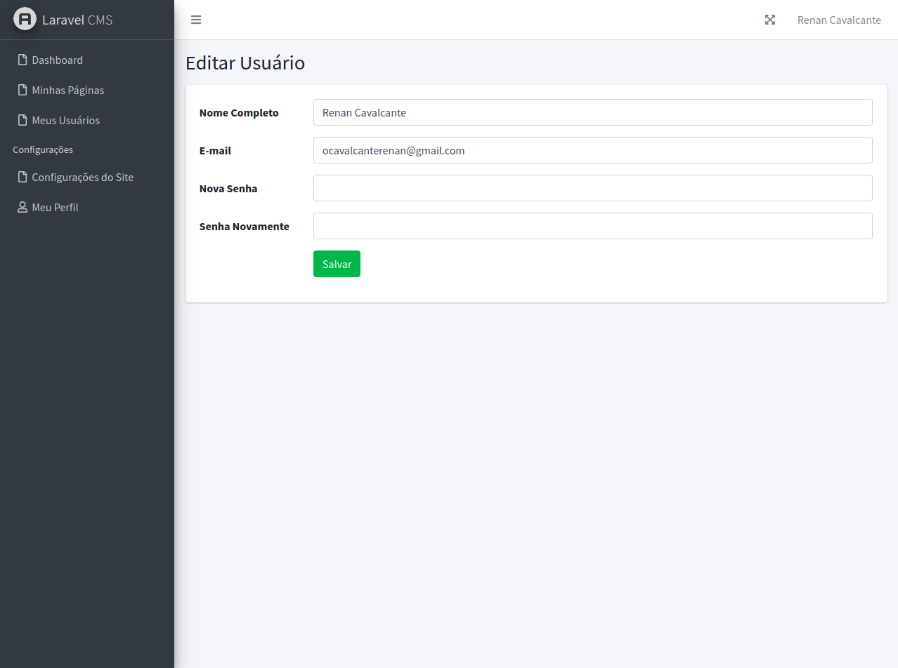
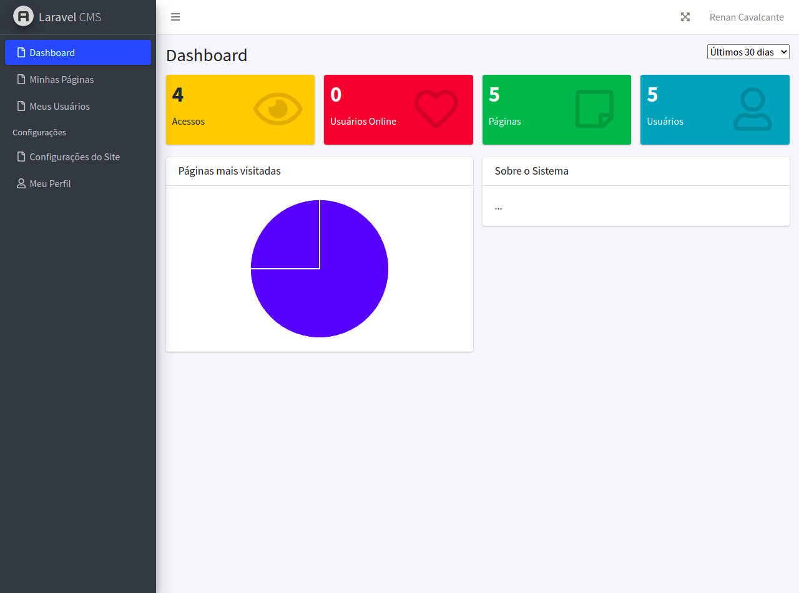

<h1 align="center">:house_with_garden: Laravel CMS :house_with_garden:</h1>

O Laravel CMS se trata de um Painel de Controle (CMS) desenvolvido para praticar o conhecimento adquirido em cursos de Laravel.

## :camera: Demonstração

  
  
    
    
    
    
    

 

## :tv: Video Demonstrativo

# Funcionalidades

 - 1 - Login
 - 2 - Register
 - 3 - Lembrar Senha
 - 4 - Logout
 - 5 - Listar Usuários
 - 6 - Adicionar Usuários
 - 7 - Editar Usuários
 - 8 - Excluir Usuários
 - 9 - Pegar informações do Perfil
 - 10 - Configurar informações do site
 - 11 - Listar Páginas
 - 12 - Adicionar Página
 - 13 - Editar Página
 - 14 - Excluir Página
 - 15 - Upload de Imagens
 - 16 - Dashboard da página

# Rotas

  - 1 - / - GET
 - 2 - /painel/ - GET
 - 3 - /painel/login - GET
 - 4 - /painel/login - POST
 - 5 - /painel/register - GET
 - 6 - /painel/register - POST
 - 7 - /painel/logout - POST
 - 8 - /painel/users - RESOURCE
 - 9 - /painel/pages - RESOURCE
 - 10 - /painel/profile - GET
 - 11 - /painel/profilesave - PUT
 - 12 - /painel/settings - GET
 - 13 - /painel/settingssave - PUT

---

## 🚀 Tecnologias

Este projeto foi desenvolvido com as seguintes tecnologias:

- ✔️ Laravel

- ✔️ AdminLTE

- ✔️ Routes

- ✔️ Image Intervention

- ✔️ Middlewares

- ✔️ TinyMCE

- ✔️ Migrations

## ⚙ Configuração via Composer

1- Para instalar o Laravel:
> composer global require laravel/installer

2- Para iniciar a aplicação:
> php artisan serve

Feito com 💜 por RENAN CAVALCANTE 👋 [Veja meu Linkedin](https://www.linkedin.com/in/renanweb/)
 
